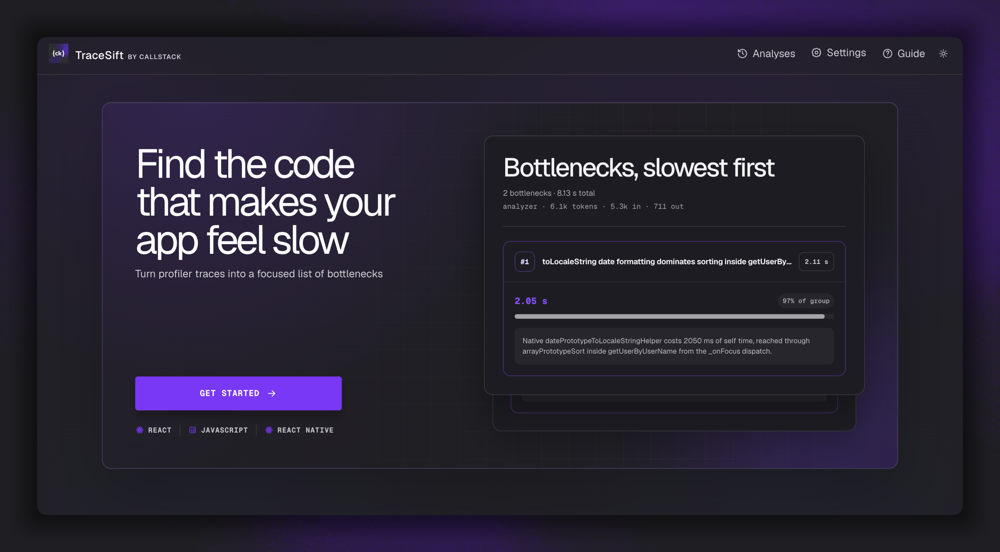
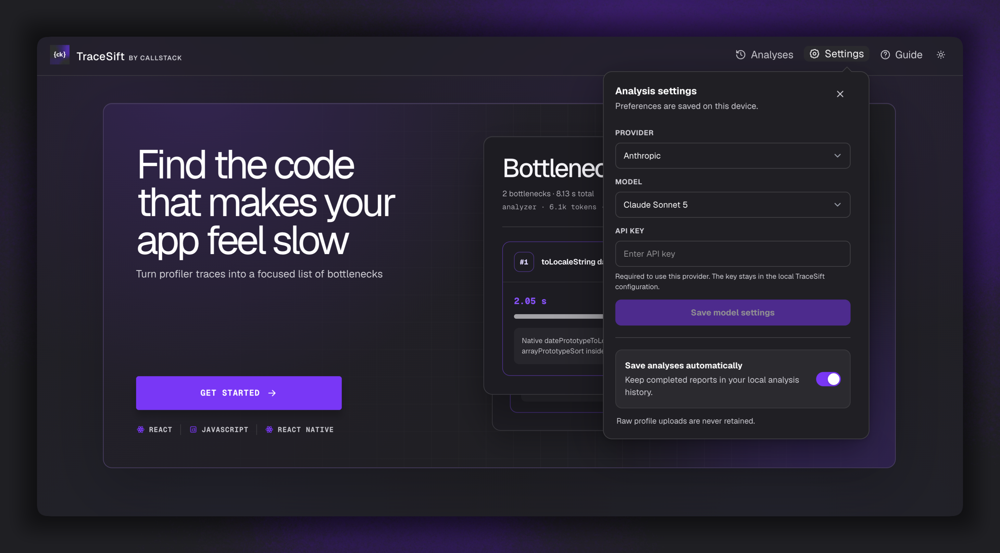
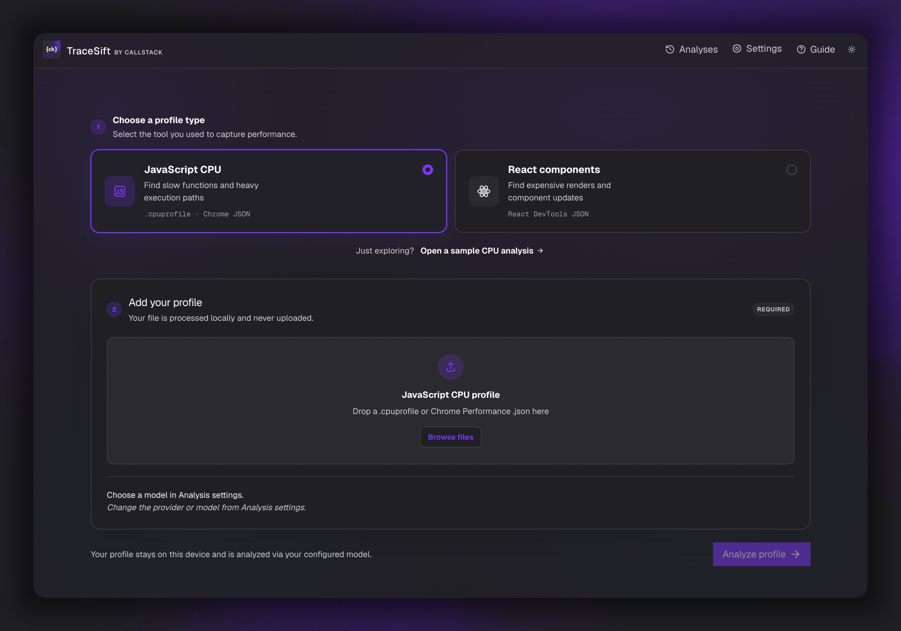
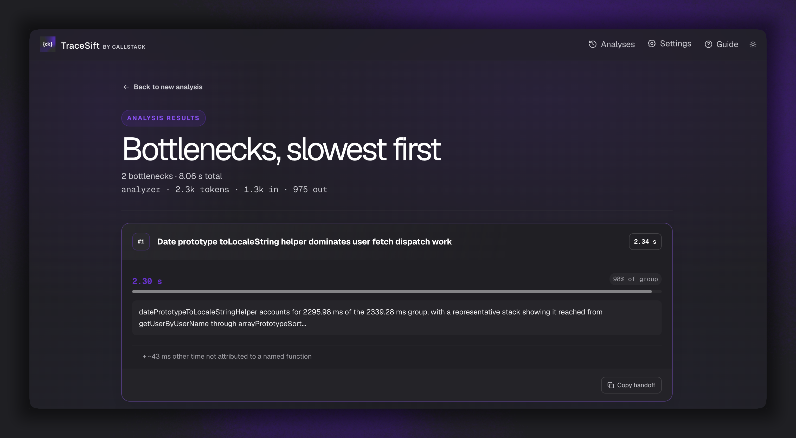
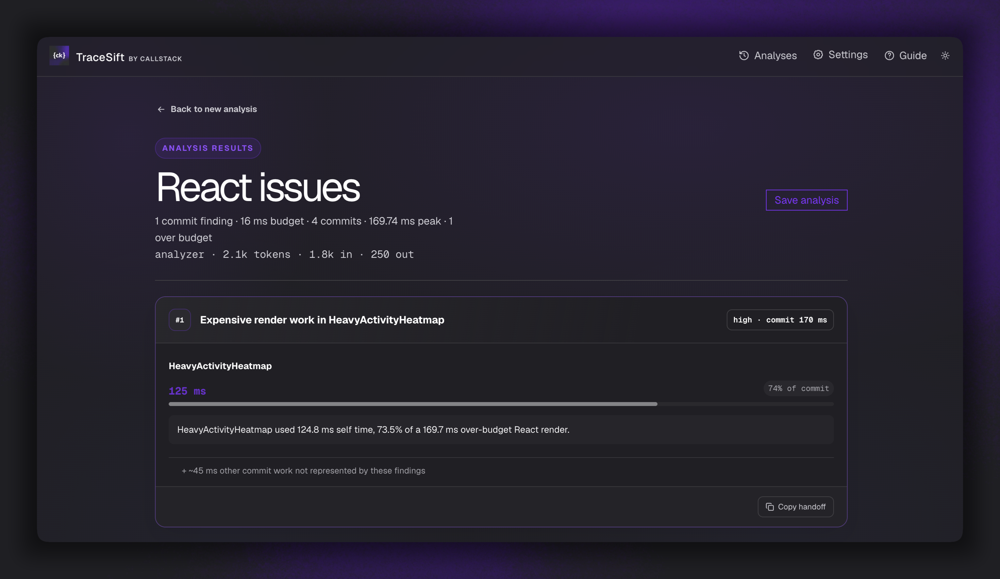
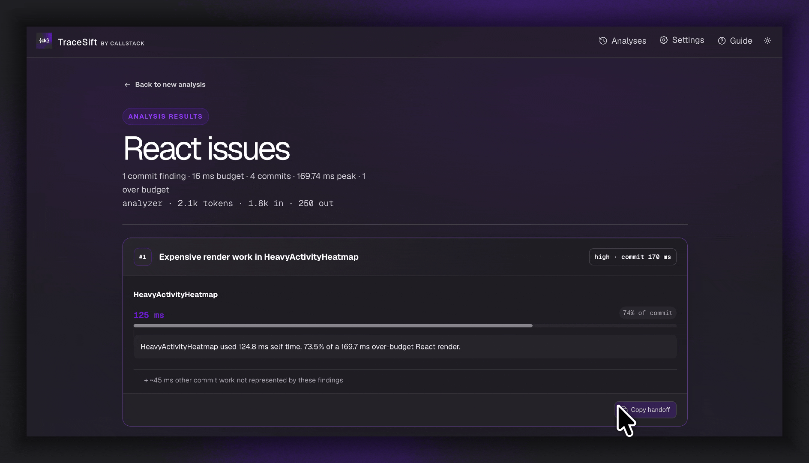
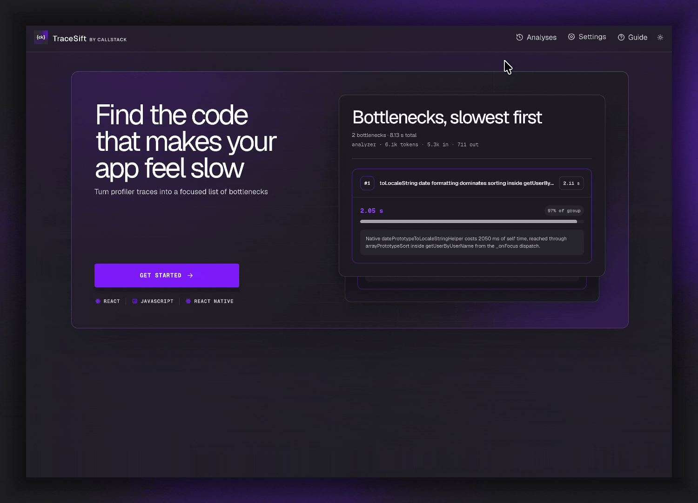
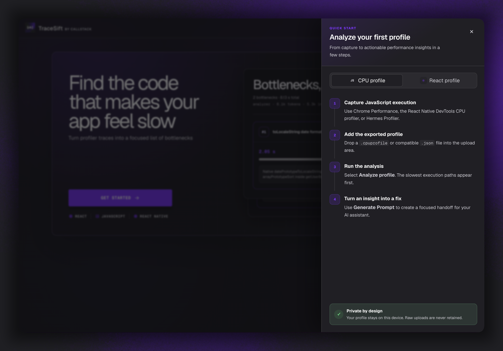

# TraceSift

Finding performance bottlenecks in a CPU or React profile takes expertise. Handing the full profile to an agent can help, but it fills the context window and burns through tokens.

**TraceSift** identifies bottlenecks in your profile and presents them in a clear, readable format, with the slowest first.

Each bottleneck includes a button to generate or copy a handoff prompt, so your agent can continue the investigation in the source code. You decide what gets fixed; the agent does the work.

Runs locally with OpenAI, Anthropic, or Callstack Apex. Your credentials stay with you.



## Usage

### 1. Install TraceSift

```sh
npm install -g @callstack/tracesift
```

Installs the TraceSift command globally. Requires Node.js 22.19 or newer and npm on macOS or Linux. The installed command does not need Git or build tools.

<!-- Add installation screenshot here -->

### 2. Initialize TraceSift (one time only)

```sh
tracesift init
```

Run this once to download and verify the prebuilt web app for your platform. After updating the CLI, run `tracesift init` again to install its matching app release.

<!-- Add initialization screenshot here -->

### 3. Start TraceSift

```sh
tracesift start
```

Starts TraceSift at `http://127.0.0.1:3000` and opens it in your browser. Press Ctrl+C to stop the server.

<!-- Add startup screenshot here -->

See the [CLI documentation](packages/cli/README.md) for storage, troubleshooting, and release details.

Contributors can run `npm run test:release:local` to verify the packaged download and startup flow against a loopback artifact server before any GitHub release. See [Contributing](CONTRIBUTING.md) for the manual browser checkpoint and Changesets release process.

## Using the web interface

### 1. Configure Analysis settings

Open **Settings** before your first analysis. Choose a provider and model, enter its API key, and select **Save model settings**; credentials stay in your local TraceSift configuration.

Enable **Save analyses automatically** to keep completed reports in local history, or disable it and save individual reports from their results page.

<!-- Add Analysis settings screenshot here -->



### 2. Start a new analysis

Select **Get Started**, then choose the profile type that matches the profiler you used, then click on "Analyze Profile".



#### JavaScript CPU and Hermes profiles

Visualize the results sorted by slowest. Each card provides a short summary of from where the issue originates and its impact on the recorded flow.

<!-- Add CPU/Hermes analysis screenshot here -->



#### React profiles

Visualize the results sorted by longest to render. Each card provides a short summary of from where the issue originates and its impact on the recorded flow.

<!-- Add React analysis screenshot here -->



### 3. Copy the handoff

When the bottleneck or React issue cards appear, choose the card you want to investigate and select **Copy Prompt**.

<!-- Add bottleneck card and handoff screenshot here -->



### 4. Reopen an analysis

Open **Analyses** to browse locally saved reports, including their findings and generated prompts. Select a report to reopen it, or delete reports you no longer need.

<!-- Add analysis history screenshot here -->



### 5. Open the guides

Select **Guide** for built-in, step-by-step instructions for capturing and analyzing JavaScript CPU, Hermes, and React profiles.

<!-- Add guides screenshot here -->



## Development

See [CONTRIBUTING.md](CONTRIBUTING.md) for setup, manual testing, automated checks, and testing the managed CLI installation.

The CLI package lives in `packages/cli`; it exports shared configuration, catalog, and server-runtime modules and uses the same pinned agent SDK version as the app.

## Made with ❤️ at Callstack

**TraceSift** is an open source project and will always remain free to use. If you think it's cool, please star it 🌟.

[Callstack](https://www.callstack.com/) is a group of React and React Native geeks, contact us at [hello@callstack.com](mailto:hello@callstack.com) if you need any help with these or just want to say hi!

## License

MIT

[license]: https://github.com/callstackincubator/tracesift/blob/main/LICENSE
